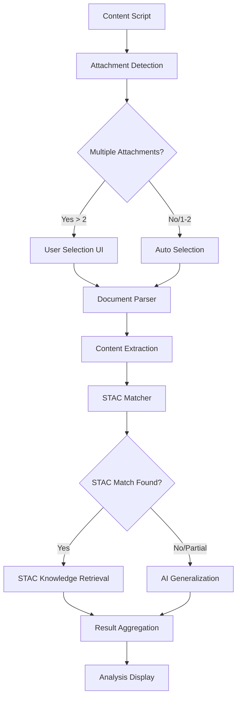

# Design Document

## Overview

This design document outlines the architecture and implementation approach for adding PDF/DOCX parsing capabilities and STAC knowledge base matching to the existing security requirements analysis Chrome extension. The solution will extend the current content detection, background processing, and analysis pipeline to handle document parsing and intelligent scenario matching.

## Architecture

### High-Level Architecture



### Component Integration

The new functionality integrates with existing components:

- **Content Script Enhancement**: Extended attachment detection with PDF/DOCX focus
- **Background Service Extension**: New document parsing and STAC matching services
- **Popup Interface Updates**: Enhanced UI for attachment selection and result display
- **New STAC Service**: Dedicated service for knowledge base operations

## Components and Interfaces

### 1. Enhanced Content Detector

**Location**: `src/content/content.js` (extended)

**New Methods**:
```javascript
class ContentDetector {
  // Enhanced attachment detection with PRD prioritization
  detectPRDAttachments()
  
  // Improved attachment classification
  classifyAttachmentRelevance(attachment)
  
  // PRD keyword matching
  isPRDRelated(filename)
}
```

**Interface**:
```javascript
{
  attachments: [
    {
      url: string,
      name: string,
      type: 'PDF' | 'DOCX' | 'DOC',
      size: string,
      isPRD: boolean,
      relevanceScore: number
    }
  ],
  pageText: string,
  recommendedAttachment: object | null
}
```

### 2. Document Parser Service

**Location**: `src/background/document-parser.js` (new)

**Responsibilities**:
- Parse PDF files using PDF.js library
- Parse DOCX files using mammoth.js library
- Handle parsing errors and fallbacks
- Extract structured content from documents

**Interface**:
```javascript
class DocumentParser {
  async parsePDF(arrayBuffer): Promise<ParsedContent>
  async parseDOCX(arrayBuffer): Promise<ParsedContent>
  async parseDocument(attachment): Promise<ParsedContent>
}

interface ParsedContent {
  text: string;
  metadata: {
    title?: string;
    author?: string;
    pages?: number;
    wordCount: number;
  };
  structure: {
    sections: Section[];
    tables: Table[];
    images: Image[];
  };
  success: boolean;
  error?: string;
}
```

### 3. STAC Knowledge Base Service

**Location**: `src/background/stac-service.js` (new)

**Responsibilities**:
- Load and index STAC knowledge base
- Perform content matching against scenarios
- Retrieve security requirements and test cases
- Calculate match confidence scores

**Interface**:
```javascript
class STACService {
  async loadKnowledgeBase(): Promise<void>
  async matchScenarios(content: string): Promise<STACMatch[]>
  async getSecurityRequirements(scenarios: string[]): Promise<SecurityRequirement[]>
  async getTestCases(scenarios: string[]): Promise<TestCase[]>
}

interface STACMatch {
  scenario: string;
  confidence: number;
  threats: Threat[];
  securityRequirements: SecurityRequirement[];
  testCases: TestCase[];
}

interface SecurityRequirement {
  name: string;
  details: string;
  source: 'STAC' | 'AI_GENERATED';
}

interface TestCase {
  name: string;
  details: string;
  expectedResult: string;
  source: 'STAC' | 'AI_GENERATED';
}
```

### 4. Enhanced Analysis Service

**Location**: `src/background/background.js` (extended)

**New Methods**:
```javascript
class SecurityAnalysisService {
  async parseAndAnalyzeDocument(attachment)
  async performSTACMatching(content)
  async generateAIFallback(content, unmatchedAreas)
  async combineSTACAndAIResults(stacResults, aiResults)
}
```

### 5. Enhanced Popup Interface

**Location**: `src/popup/popup.js` (extended)

**New UI Components**:
- Attachment selection interface for multiple documents
- STAC coverage indicator
- Differentiated result display (STAC vs AI-generated)
- Progress indicators for parsing operations

## Data Models

### STAC Knowledge Base Structure

```javascript
interface STACKnowledgeBase {
  [scenario: string]: {
    threats: Threat[];
  }
}

interface Threat {
  name: string;
  details: string;
  security_requirement: SecurityRequirement;
  security_design: SecurityDesign;
  test_case: TestCase;
  industry_standard: IndustryStandard | null;
}
```

### Analysis Result Structure

```javascript
interface AnalysisResult {
  source: {
    type: 'attachment' | 'webpage';
    name?: string;
    metadata?: DocumentMetadata;
  };
  stacAnalysis: {
    matchedScenarios: STACMatch[];
    coverage: {
      total: number;
      matched: number;
      percentage: number;
    };
    securityRequirements: SecurityRequirement[];
    testCases: TestCase[];
  };
  aiAnalysis: {
    generatedFor: string[];
    securityRequirements: SecurityRequirement[];
    testCases: TestCase[];
    confidence: 'high' | 'medium' | 'low';
  };
  combined: {
    summary: string;
    assets: string[];
    threats: Threat[];
    testScenarios: TestScenario[];
    recommendations: string[];
  };
  timestamp: string;
}
```

## Error Handling

### Document Parsing Errors

1. **File Access Errors**: Handle CORS issues, network failures, and permission problems
2. **Format Errors**: Manage corrupted files, unsupported formats, and encoding issues
3. **Size Limitations**: Implement file size limits and memory management
4. **Timeout Handling**: Set reasonable timeouts for parsing operations

### STAC Matching Errors

1. **Knowledge Base Loading**: Handle missing or corrupted STAC data
2. **Matching Failures**: Graceful degradation when matching algorithms fail
3. **Performance Issues**: Implement caching and optimization for large knowledge bases

### Fallback Strategies

```javascript
const FALLBACK_CHAIN = [
  'parseAttachment',
  'extractPageText', 
  'requestManualInput',
  'useBasicAIAnalysis'
];
```

## Testing Strategy

### Unit Testing

1. **Document Parser Tests**
   - Test PDF parsing with various document types
   - Test DOCX parsing with different formatting
   - Test error handling for corrupted files

2. **STAC Service Tests**
   - Test scenario matching accuracy
   - Test knowledge base loading and indexing
   - Test performance with large datasets

3. **Integration Tests**
   - Test end-to-end document processing flow
   - Test STAC and AI result combination
   - Test UI interaction with multiple attachments

### Performance Testing

1. **Document Parsing Performance**
   - Measure parsing time for different file sizes
   - Test memory usage during parsing
   - Validate timeout handling

2. **STAC Matching Performance**
   - Benchmark matching algorithms
   - Test with various content lengths
   - Optimize knowledge base queries

### User Experience Testing

1. **Attachment Selection Flow**
   - Test multi-attachment scenarios
   - Validate PRD prioritization
   - Test user selection interface

2. **Result Display Testing**
   - Test STAC vs AI content differentiation
   - Validate coverage indicators
   - Test result export functionality

## Security Considerations

### Document Processing Security

1. **File Validation**: Strict validation of uploaded documents
2. **Sandboxing**: Isolate document parsing operations
3. **Memory Management**: Prevent memory exhaustion attacks
4. **Content Sanitization**: Clean extracted content before processing

### STAC Knowledge Base Security

1. **Data Integrity**: Verify knowledge base integrity on load
2. **Access Control**: Restrict knowledge base modifications
3. **Sensitive Information**: Ensure no sensitive data in knowledge base

### AI Integration Security

1. **API Security**: Secure communication with AI services
2. **Data Privacy**: Minimize data sent to external AI services
3. **Result Validation**: Validate AI-generated content for safety

## Performance Optimization

### Document Parsing Optimization

1. **Lazy Loading**: Load parsing libraries only when needed
2. **Web Workers**: Use web workers for heavy parsing operations
3. **Caching**: Cache parsed results for repeated access
4. **Progressive Loading**: Stream large document processing

### STAC Matching Optimization

1. **Indexing**: Pre-index knowledge base for faster searches
2. **Fuzzy Matching**: Implement efficient fuzzy matching algorithms
3. **Result Caching**: Cache matching results for similar content
4. **Parallel Processing**: Process multiple scenarios concurrently

### Memory Management

1. **Resource Cleanup**: Properly dispose of large objects
2. **Streaming**: Use streaming for large file processing
3. **Garbage Collection**: Optimize for browser garbage collection
4. **Memory Monitoring**: Monitor and alert on high memory usage