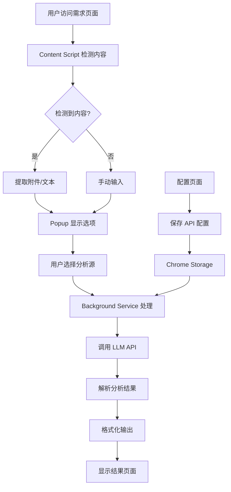

# 项目架构文档

## 🏗️ 整体架构

```
Security Requirements Analyzer Chrome Extension
├── 🎯 核心功能层 (Core Layer)
│   ├── Content Detection (内容检测)
│   ├── LLM Integration (AI集成)
│   ├── Security Analysis (安全分析)
│   └── Result Processing (结果处理)
│
├── 🖥️ 用户界面层 (UI Layer)
│   ├── Popup Interface (弹窗界面)
│   ├── Configuration Page (配置页面)
│   └── Result Display (结果展示)
│
├── 🔧 服务层 (Service Layer)
│   ├── Background Service (后台服务)
│   ├── Storage Management (存储管理)
│   └── API Communication (API通信)
│
└── 🛠️ 基础设施层 (Infrastructure Layer)
    ├── Chrome Extension APIs
    ├── Debug Tools (调试工具)
    └── Configuration Management (配置管理)
```

## 📊 数据流架构



## 🔄 组件交互图

```
┌─────────────────┐    ┌─────────────────┐    ┌─────────────────┐
│   Content.js    │    │    Popup.js     │    │  Background.js  │
│   (页面检测)     │◄──►│   (用户界面)     │◄──►│   (后台服务)     │
└─────────────────┘    └─────────────────┘    └─────────────────┘
         │                       │                       │
         ▼                       ▼                       ▼
┌─────────────────┐    ┌─────────────────┐    ┌─────────────────┐
│  页面DOM元素     │    │  Chrome Storage │    │   LLM APIs     │
│  附件链接       │    │  用户配置       │    │  OpenAI/Azure   │
│  文本内容       │    │  分析历史       │    │  Anthropic      │
└─────────────────┘    └─────────────────┘    └─────────────────┘
```

## 🎯 核心模块详解

### 1. Content Detection Module (内容检测模块)
- **文件**: `src/content/content.js`
- **功能**: 检测页面附件、提取文本内容
- **依赖**: DOM API, Chrome Runtime API

### 2. UI Components (界面组件)
- **Popup**: `src/popup/` - 主要用户交互界面
- **Config**: `src/config/` - 配置管理界面
- **Results**: 动态生成的结果展示页面

### 3. Background Service (后台服务)
- **文件**: `src/background/background.js`
- **功能**: API调用、数据处理、消息路由
- **依赖**: Chrome APIs, External APIs

### 4. Debug Tools (调试工具)
- **文件**: `src/debug/`
- **功能**: 开发调试、错误追踪、性能监控

## 🔧 技术栈

### 前端技术
- **HTML5**: 语义化标记
- **CSS3**: 响应式设计、现代布局
- **JavaScript ES6+**: 模块化、异步编程

### Chrome Extension APIs
- **Manifest V3**: 现代扩展标准
- **Content Scripts**: 页面内容访问
- **Background Service Worker**: 后台处理
- **Storage API**: 数据持久化
- **Tabs API**: 标签页管理

### 外部集成
- **OpenAI API**: GPT-4 Vision Preview
- **Azure OpenAI**: 企业级AI服务
- **Anthropic API**: Claude模型

## 📁 目录结构设计

```
src/
├── content/           # 内容脚本
├── popup/            # 弹窗界面
├── config/           # 配置页面
├── background/       # 后台服务
├── debug/            # 调试工具
├── shared/           # 共享组件
└── assets/           # 静态资源

docs/                 # 文档
├── api/              # API文档
├── guides/           # 使用指南
└── screenshots/      # 项目截图

tools/                # 开发工具
├── build/            # 构建脚本
└── debug/            # 调试脚本
```

## 🔄 开发工作流

### 1. 开发环境设置
```bash
1. 克隆项目
2. 在Chrome中加载插件
3. 配置API密钥
4. 启动调试模式
```

### 2. 代码修改流程
```bash
1. 修改源代码
2. 刷新插件
3. 测试功能
4. 提交代码
```

### 3. 调试流程
```bash
1. 使用内置调试工具
2. Chrome DevTools
3. 查看日志输出
4. 性能分析
```

## 🚀 部署架构

### 开发环境
- 本地Chrome扩展加载
- 开发者模式调试
- 热重载支持

### 生产环境
- Chrome Web Store发布
- 版本管理
- 用户反馈收集

## 🔒 安全架构

### 数据安全
- API密钥本地存储
- HTTPS通信
- 输入验证

### 权限管理
- 最小权限原则
- 用户授权确认
- 敏感操作审计

## 📈 性能优化

### 加载优化
- 懒加载模块
- 资源压缩
- 缓存策略

### 运行优化
- 异步处理
- 内存管理
- API调用优化

---

此架构文档将随着项目发展持续更新，确保团队成员对系统架构有清晰的理解。