# 项目架构图

## 🏗️ 整体架构图

```mermaid
graph TB
    subgraph "用户界面层 (UI Layer)"
        A[Popup Interface<br/>弹窗界面]
        B[Configuration Page<br/>配置页面]
        C[Result Display<br/>结果展示]
    end
    
    subgraph "核心功能层 (Core Layer)"
        D[Content Detection<br/>内容检测]
        E[Security Analysis<br/>安全分析]
        F[LLM Integration<br/>AI集成]
    end
    
    subgraph "服务层 (Service Layer)"
        G[Background Service<br/>后台服务]
        H[Storage Management<br/>存储管理]
        I[API Communication<br/>API通信]
    end
    
    subgraph "基础设施层 (Infrastructure)"
        J[Chrome Extension APIs<br/>Chrome扩展API]
        K[Debug Tools<br/>调试工具]
        L[Configuration Management<br/>配置管理]
    end
    
    A --> D
    A --> G
    B --> H
    B --> L
    D --> G
    E --> F
    F --> I
    G --> J
    G --> H
    K --> G
    K --> D
```

## 🔄 数据流架构图

```mermaid
sequenceDiagram
    participant User as 用户
    participant Popup as Popup界面
    participant Content as Content Script
    participant Background as Background Service
    participant LLM as LLM API
    participant Storage as Chrome Storage
    
    User->>Popup: 点击插件图标
    Popup->>Content: 检测页面内容
    Content->>Popup: 返回检测结果
    Popup->>User: 显示内容选项
    User->>Popup: 选择分析内容
    Popup->>Background: 发送分析请求
    Background->>Storage: 读取配置
    Storage->>Background: 返回API配置
    Background->>LLM: 调用AI分析
    LLM->>Background: 返回分析结果
    Background->>Popup: 返回处理结果
    Popup->>User: 显示分析报告
```

## 🎯 模块依赖关系图

## 🔧 技术栈架构图

```mermaid
graph TD
    subgraph "前端技术栈"
        A1[HTML5<br/>语义化标记]
        A2[CSS3<br/>响应式设计]
        A3[JavaScript ES6+<br/>模块化编程]
    end
    
    subgraph "Chrome Extension APIs"
        B1[Manifest V3<br/>扩展标准]
        B2[Content Scripts<br/>页面访问]
        B3[Background Service<br/>后台处理]
        B4[Storage API<br/>数据存储]
        B5[Tabs API<br/>标签管理]
    end
    
    subgraph "外部集成"
        C1[OpenAI API<br/>GPT-4 Vision]
        C2[Azure OpenAI<br/>企业AI服务]
        C3[Anthropic API<br/>Claude模型]
    end
    
    subgraph "开发工具"
        D1[Chrome DevTools<br/>调试工具]
        D2[VS Code<br/>代码编辑]
        D3[Git<br/>版本控制]
        D4[Node.js<br/>构建工具]
    end
    
    A1 --> B1
    A2 --> B1
    A3 --> B1
    B3 --> C1
    B3 --> C2
    B3 --> C3
    D1 --> B1
    D2 --> A3
    D3 --> D4
```

## 📊 组件交互图

```mermaid
graph TB
    subgraph "Browser Context"
        A[Web Page<br/>需求管理页面]
        B[Content Script<br/>内容检测脚本]
    end
    
    subgraph "Extension Context"
        C[Popup<br/>用户界面]
        D[Background<br/>后台服务]
        E[Config Page<br/>配置页面]
        F[Chrome Storage<br/>本地存储]
    end
    
    subgraph "External Services"
        G[LLM APIs<br/>AI服务]
        H[Threat Modeling<br/>威胁建模平台]
    end
    
    A --> B
    B <--> C
    C <--> D
    E <--> F
    D <--> F
    D <--> G
    D <--> H
    
    style A fill:#e1f5fe
    style G fill:#fff3e0
    style H fill:#f3e5f5
```

## 🔒 安全架构图

```mermaid
graph TD
    subgraph "数据安全层"
        A[API密钥加密存储]
        B[HTTPS通信]
        C[输入验证]
    end
    
    subgraph "权限管理层"
        D[最小权限原则]
        E[用户授权确认]
        F[敏感操作审计]
    end
    
    subgraph "隐私保护层"
        G[本地数据处理]
        H[不上传完整文档]
        I[用户数据控制]
    end
    
    A --> D
    B --> E
    C --> F
    D --> G
    E --> H
    F --> I
```

## 📈 性能优化架构图

```mermaid
graph LR
    subgraph "加载优化"
        A[懒加载模块]
        B[资源压缩]
        C[缓存策略]
    end
    
    subgraph "运行优化"
        D[异步处理]
        E[内存管理]
        F[API调用优化]
    end
    
    subgraph "用户体验优化"
        G[响应式设计]
        H[错误处理]
        I[进度反馈]
    end
    
    A --> D --> G
    B --> E --> H
    C --> F --> I
```

## 🚀 部署架构图

```mermaid
graph TB
    subgraph "开发环境"
        A[本地开发]
        B[Chrome DevTools]
        C[热重载]
    end
    
    subgraph "测试环境"
        D[功能测试]
        E[兼容性测试]
        F[性能测试]
    end
    
    subgraph "生产环境"
        G[Chrome Web Store]
        H[企业分发]
        I[用户反馈]
    end
    
    A --> D
    B --> E
    C --> F
    D --> G
    E --> H
    F --> I
```

---

这些架构图帮助开发者快速理解项目的整体结构和各组件之间的关系，便于后续的开发和维护工作。